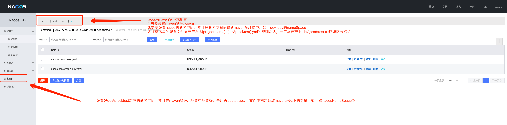
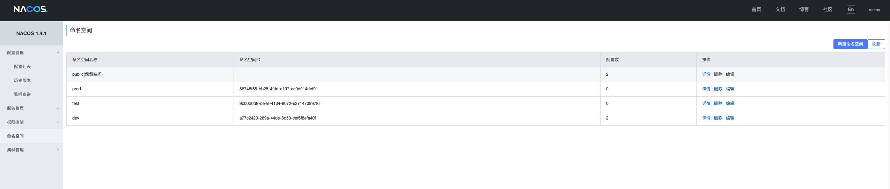
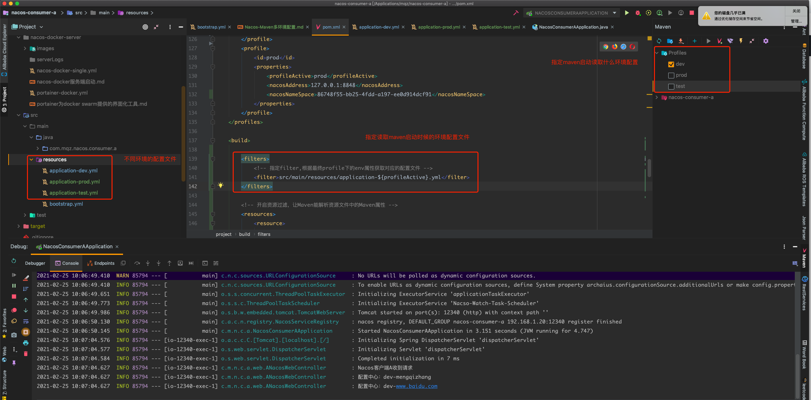

# Nacos-Maven多环境配置
- 
- 

- 1.Maven配置文件中配置dev、prod、test的配置分别对应不同的NacosServerAddress、NacosNameSpace等，详情可参考本项目的pom.xml配置
- 2.NacosServer：localhost:8848/nacos 中分别设置dev、prod、test的nameSpace，需要关联到Maven中的dev、prod、test等

- 3.Nacos配置文件的命名规则：
 * #${prefix}-${spring.profile.active}.${file-extension}
 * # ${spring.application.name}-${spring.profile.active}.${file-extension}

# Maven多环境启动

- 

- 如果是idea直接debug、run启动的话，需要勾选指定环境（maven-Profiles： dev、prod、test等）
- 使用命令打包： mvn clean install -Pprod (-P指定环境： prod、dev、test，-pl指定模块，-DskipTests=true)

