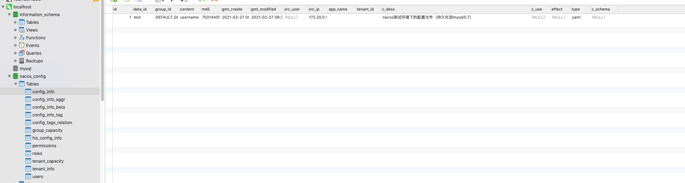
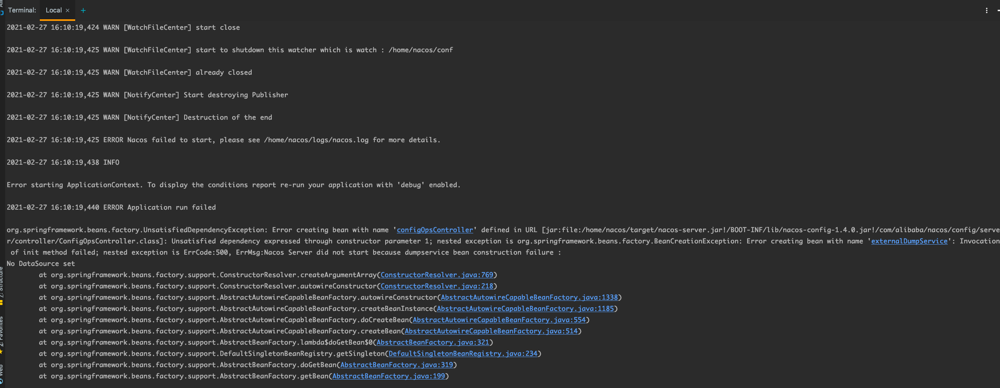
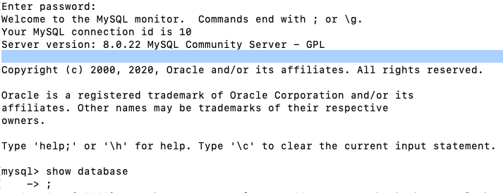

# Nacos持久化配置-mysql

1.mysql创建 nacos_config 数据库，并且执行以下的sql脚本 ：https://github.com/alibaba/nacos/blob/master/config/src/main/resources/META-INF/nacos-db.sql
2.配置nacos-hostname.env mysql相关的配置参数。
3.并且把该外部配置加入到docker-compose ->  env:

MySQL 5.7 (官方镜像不支持mysql8)

