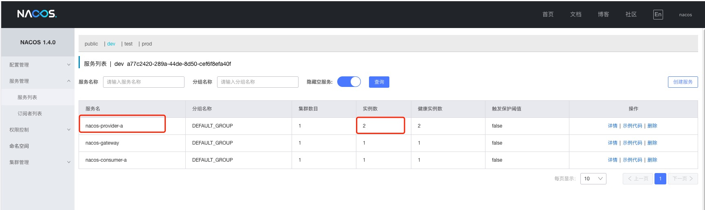

# Nacos客户端  nacos-consumer-a 项目地址： https://github.com/DemoMeng/nacos-consumer-a
- 配置Nacos服务端
- 配置Portainer
- 配置Nacos配置中心
- Maven多环境配置+Nacos多环境命名空间 
- Feign调用nacos-provider-a(另外一个节点nacos-consumer-b)
 *

# Gateway网关  nacos-gateway 项目地址： https://github.com/DemoMeng/nacos-gateway
- 配置Nacos注册中心
- 配置Nacos配置中心
- 配置Gateway全局过滤器、Routes路由转发过滤配置
- Maven多环境配置+Nacos多环境命名空间

# Nacos客户端 nacos-provider-a 项目地址： https://github.com/DemoMeng/nacos-provider-a
- 服务提供方a
- Nacos服务注册中，配置中心

# Nacos客户端 nacos-provider-b 项目地址： https://github.com/DemoMeng/nacos-provider-b
- 因为是单服务器上无法实现多个节点，这个项目模拟nacos-provider-a的另外节点
- 服务提供方a的另外一个节点
- Nacos服务注册中，配置中心

#SpringBoot、SpringCloud、SpringCloudAlibaba三者版本兼容参考：

 