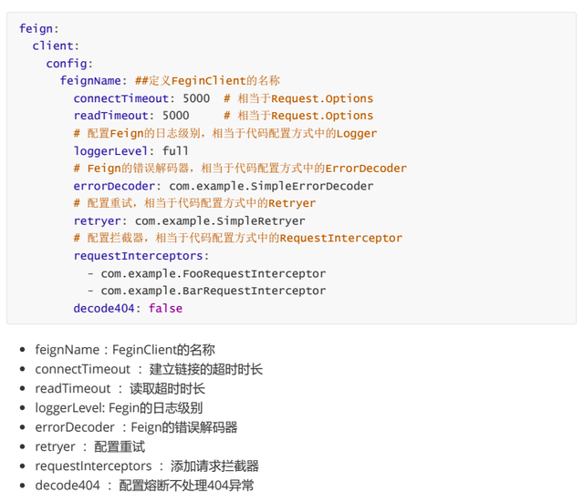

# OpenFeign使用说明

## 定义
    feign是一个声明伪http客户端
    openfeign 默认集成了ribbon实现RB效果，
    openfeign 支持Hystrix的fallback（集成到了FeignClient中）
    openfeign 支持HTTP请求和响应的压缩
    openfeign 支持name（服务名，FeignClient(name='service-a')）级别的配置
    openfeign 重试机制，可以不依赖注册中心独立运行，url支持占位符

## 使用步骤： 
##### 1.服务提供方：
    1. 编写一个http接口

##### 2.服务消费方：
    1. 引入spring-cloud 、spring-cloud-openfeign依赖
    2. 定义feign接口，并使用@EnableFeign声明该接口为feign的接口，且参数名、接口地址，需要和服务提供方一致
    2. 声明服务为feign客户端（启动类上加入@EnableFeignClients自动配置注解，并且配置扫描包，扫描定义的feign接口）

## 关键注解：
##### @FeignClient(name/value = "service-a", url="http://192.168.2.11:8081/",fallback = ErrorServiceImpl.class,configuration=FeignConfig.class)

    name/value: 被调用方的服务名，同时开启了ribbon会创建 服务名.ribbon的负载均衡器，相关设置参考：application-dev.yml 
    url： 直连服务地址，没有开启Ribbon的情况下
    fallback： 实现异常熔断回退方式，需要开启feign中的Hystrix的支持 ->  feign.hystrix.enabled=true
    configuration：用于记录，拦截器等额外配置...更多内容如下。

##  OpenFeign使用的http客户端
##### OpenFeign的默认HTTP客户端HttpUrlConnection用于执行其HTTP请求。您可以配置其他客户端（ApacheHttpClient，OkHttpClient，...）

## 超时配置：
    
    ribbon.connectTime = 500
    ribbon.readTimeout = 500
    service-a.ribbon.readTimeout = 500
    service-a.connectTime = 500

## 从SpringCloudEdgware开始，Feign支持使用属性自定义Feign。对于一个指定名称的FeignClient（例如该FeignClient的名称为feignName），Feign支持如下配置项：

## 相关功能：

##### 1.参数绑定：

    参数名需要保持一致，并且若参数是一个实体对象的话，需要给该实体添加一个无参的构造函数否则Spring Cloud Feign根据JSON字符串转换User对象时会抛出异常

    服务方： 
        @RequestParam String name
        @RequestHeader String name
        @RequestBody User user

    消费方： FeignClient
        @RequestParam("name") String name
        @RequestHeader("name") String name
        @RequestBody User user

    注意：在定义各参数绑定时，@RequestParam、@RequestHeader 等可以指定参数名称的注解，它们的 value 不能为空。虽然在 Spring MVC 程序中，这些注解会根据参数名来作为默认值，但是在 Feign 中绑定参数必须通过 value 属性来指明具体参数名，不然会抛出 IllegalStateException 异常。

##### 2.继承特性：
    
    现是服务方提供一个http接口，编写参数名及路由接口地址，消费方复制一份到定义到接口上。实际上是重复的代码！

    利用spring-cloud-openfeign的继承特性可以缩减部分公共的代码量；

    做法：
        1. 新建一个基础项目，把消费方的接口移植到这里，并且消费方需要依赖这个项目，并继承移植的接口
        2. 服务提供方的controller实现这个接口，并且依赖这个项目

    参考： 
        provider:FeignApiController
        consumer:FeignApiService
        nacos-feign: FeignApi

##### 3. ribbon设置：
    
    消费方：

        全局设置：
            #求连接超时时间
            ribbon.ConnectionTimeout = 500
            #请求处理的超时时间
            ribbon.ReadTimeout = 500
        
        单个服务设置：
            
            nacos-provider-a.ribbon.ConnnectionTimeout = 700
            nacos-provider-a.ribbon.ReadTimeout=700

    
    