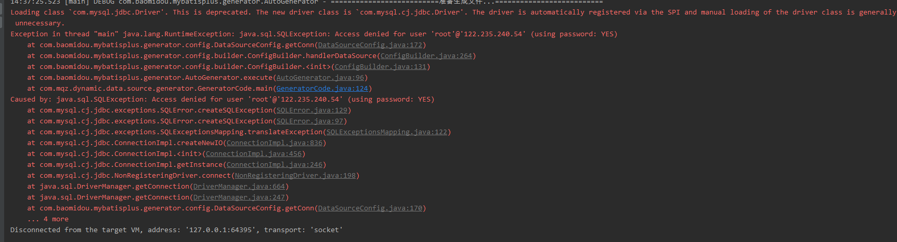

# docker-compose安装mysql5.7
    
 - docker run的方式启动mysql：注意需要配置三个挂载目录：数据，日志，配置否则会出现报错。 
    * docker run -p 3306:3306 --name mysql5.7ByRun  --privileged=true -v /data/log:/var/log/mysql -v /data/data:/var/lib/mysql -v /data/conf:/etc/mysql -e MYSQL_ROOT_PASSWORD=mengqizhang -d mysql:5.7
 - docker compose方式启动mysql：请参考 nacos-docker-server/docker-compose-mysql57.yml的配置文件
    * docker-compose -f nacos-docker-server/docker-compose-mysql57.yml up -d
    

# 服务器安装docker-compose 
1. github手动下载文件docker-compose-Linux-x86_64：https://github.com/docker/compose/releases/tag/1.25.0-rc4
2. 将文件上传到/usr/local/bin/ 目录下，重命名为docker-compose，修改文件权限 : chmod +x /usr/local/bin/docker-compose
3. 安装完成：docker-compose -v查看版本

#docker 设置镜像源，解决pull拉取慢的问题：
- 1.修改(没有就创建) /etc/docker/daemon.json为：
   {
    "registry-mirrors": ["https://9cpn8tt6.mirror.aliyuncs.com"]
   }
- 2.重新加载：  [root@mqz docker]# systemctl daemon-reload
- 3.重启docker：[root@mqz docker]# systemctl restart docker

# mysql 权限问题： 
 - 
 
 - 查看权限： 
 
 - 解决： 
   1. grant all privileges on *.* to 'root'@'%' with grant option;
   2. flush privileges;
 
 GRANT ALL PRIVILEGES ON *.* TO 'root'@'%' IDENTIFIED BY 'mengqizhang' WITH GRANT OPTION;

