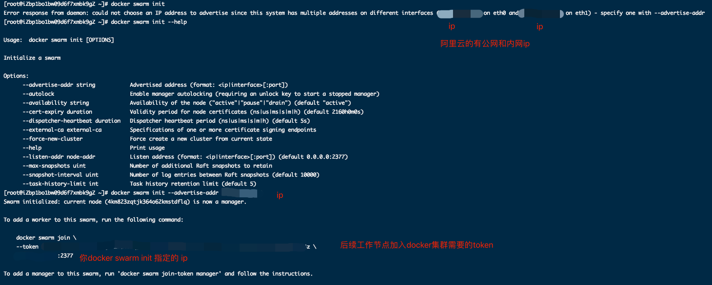
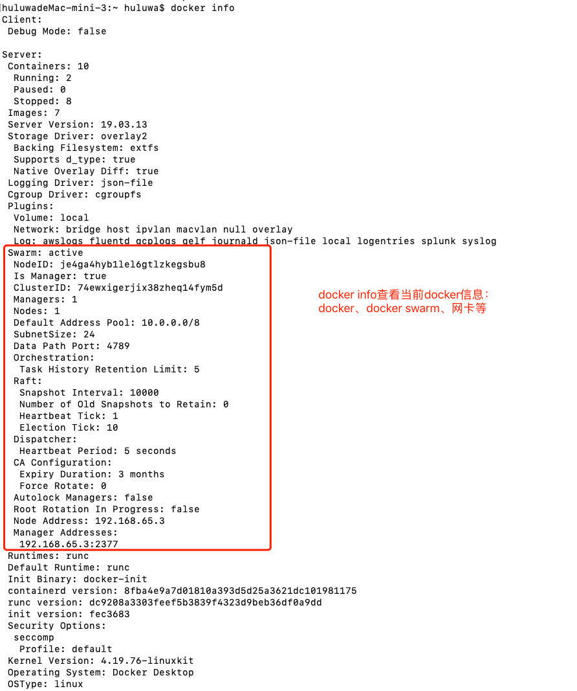

# docker swarm:集群配置
- docker swarm leave : 删除当前docker集群节点，如果是管理节点： docker swarm leave --force
- docker swarm init: 初始docker集群，该命令会自动把当前服务器作为一个管理节点，执行该命令返回的信息：

    * Swarm initialized: current node (je4ga4hyb1lel6gtlzkegsbu8) is now a manager.
    * To add a worker to this swarm, run the following command:
    *     docker swarm join --token SWMTKN-1-2t4juac2s9j94ocnypc6mql6w8szh49lfz7d7vdle4ct2h8lxt-071wuhx12veggfoqm2gblqsuf 192.168.65.3:2377
    * To add a manager to this swarm, run 'docker swarm join-token manager' and follow the instructions.
    
- dokcer swarm init --advertise-addr:阿里云的公网和内网ip时候需要指定一个ip作为当前nacos节点的ip
    * 
    
- docker info：查看当前docker的信息，docker，docker swarm，网卡等
    * 
    
- docker swarm join --token SWMTKN-1-2t4juac2s9j94ocnypc6mql6w8szh49lfz7d7vdle4ct2h8lxt-071wuhx12veggfoqm2gblqsuf 192.168.65.3:2377:
  * 把当前服务加入到加入到docker swarm （192.168.65.3管理节点）中并作为工作节点  
  
  
- netstat -tunlp 用于显示 tcp，udp 的端口和进程等相关情况。
  * netstat 查看端口占用语法格式：
  * netstat -tunlp | grep 端口号
  * -t (tcp) 仅显示tcp相关选项
  * -u (udp)仅显示udp相关选项
  * -n 拒绝显示别名，能显示数字的全部转化为数字
  * -l 仅列出在Listen(监听)的服务状态
  * -p 显示建立相关链接的程序名
  