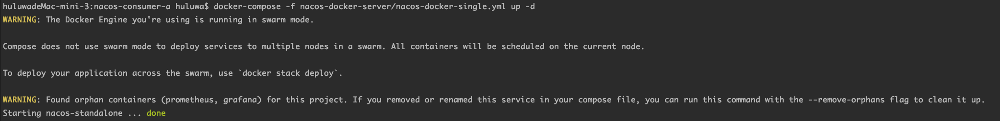

# 服务端启动

 - docker swarm: 解决的是在多台服务器/主机上部署多个容器集群 (docker集群)
 - docker compose: 解决的是在同一台服务器/主机上部署多个容器的工具 (docker单机)

 - 启动服务端（前台启动）： docker-compose -f nacos-docker-server/nacos-docker-single.yml up
 - 启动服务端（后台运行）： docker-compose -f nacos-docker-server/nacos-docker-single.yml up -d
 
 
 - docker swarm init ：把当前服务器（主机）加入到docker swarm 节点中
 - docker swarm leave ： 把当前服务器（主机）从docker swarm 节点中移除
 
 
# 问题列表：

- ERROR: for nacos-standalone  Cannot start service nacos: Mounts denied: 
  The path /Applications/mqz/nacos-consumer-a/nacos-docker-server/Applications/mqz/nacos-consumer-a/nacos-docker-server/serverLogs is not shared from the host and is not known to Docker.
  You can configure shared paths from Docker -> Preferences... -> Resources -> File Sharing.
  Creating grafana          ... done
- 解决： 需要设置docker文件共享（linux）

- 在docker engine中是swarm模式的话，docker-compose是不被允许的，但是还能使用，建议使用docker stack deploy 启动容器 
- 

- docker stack deploy -c nacos-docker-server/nacos-docker-single.yml nacos-docker-swarm-1 替换 docker-compose....启动命令
