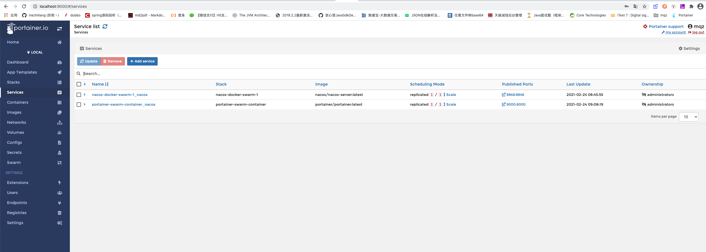
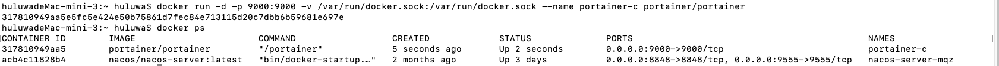
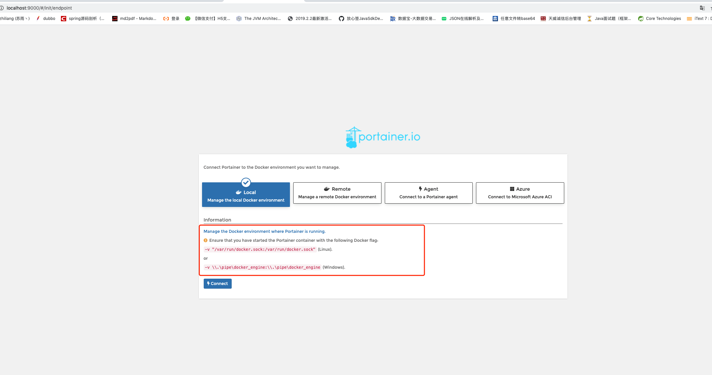

# docker swarm界面化工具-portainer
- 1.编写portainer-docker.yml配置文件
- 2.执行： docker-compose -f nacos-docker-server/portainer-docker.yml up -d 启动命令（这里可以使用docker stack命令替代和nacos启动命令一直）
- 注意：
  * 如果是使用docker stack deploy 启动在portainer中的service中会有这个服务容器，有了这个服务的概念。
  * 所以考虑这个因为portainer是单机的，可以使用docker-compose -f ** 启动即可。
  * 
  
 

#【Docker界面化工具Portainer -- 这个是docker run的方式 】
- 使用步骤：
    * 1.搜索并下载portainer最新镜像： docker search portainer/portainer 、 docker pull portainer/portainer
    * 2.运行下载的portainer镜像：docker run -d -p 9000:9000 --name portainer-c portainer/portainer -v /var/run/docker.sock:/var/run/docker.sock
    * 
    
- 释义：
    * docker run -d  
      -p 9000:9000                                      # portainer默认端口是9000，映射到本地9000端口，通过本地地址访问
      --restart=always                                  # 设置自动重启
      -v /var/run/docker.sock:/var/run/docker.sock  　　 # 单机必须指定docker.sock
      --name Prtainer portainer/portainer               #指定容器名称，根据镜像生成
      
    * 

